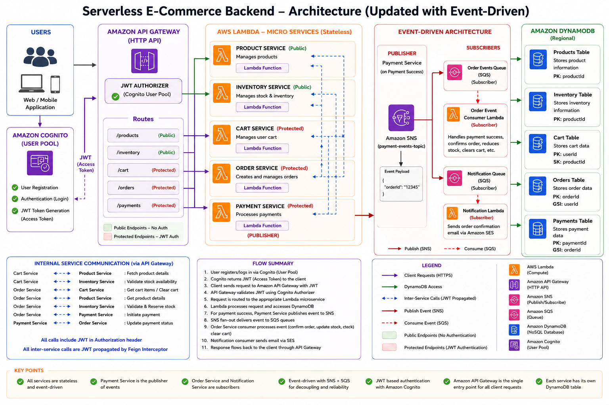

# Serverless E-Commerce Microservices Backend

A cloud-native serverless e-commerce backend built using **Spring Boot 3.2.5**, **Java 21**, **AWS Lambda**, **Amazon API Gateway**, **Amazon DynamoDB**, **Amazon Cognito**, **Amazon SNS/SQS**, **Amazon SES**, and **Amazon S3**.

The application consists of independent microservices deployed as AWS Lambda functions behind a shared HTTP API Gateway. Authentication is handled using **Amazon Cognito** and **API Gateway JWT Authorizers**. Event-driven workflows use **Amazon SNS** and **Amazon SQS** for payment and order processing, with **Amazon SES** for email notifications.

## Live Demo

https://dhvfhexmyhpvv.cloudfront.net/

---

## Architecture Diagram



---

## Tech Stack

### Backend & Microservices

- Java 21
- Spring Boot 3.2.5
- Spring Data
- OpenFeign (Inter-service communication)
- Lombok
- Maven

### Cloud & Serverless Infrastructure (AWS)

- AWS Lambda Functions (Java 21 `StreamLambdaHandler`)
- Amazon API Gateway (HTTP API v2)
- Amazon DynamoDB (Enhanced Client)
- Amazon Cognito User Pool (JWT Authorizer)
- Amazon SNS (Event Publishing)
- Amazon SQS (Asynchronous Event Consumer Queues)
- Amazon SES (Order Email Notifications)
- Amazon S3 (Deployment Artifacts & Image Uploads)
- Amazon CloudFront (CDN)
- AWS X-Ray (Distributed Tracing & Service Maps)
- AWS IAM (Short-lived OIDC Role Authentication)

### CI/CD & Security

- GitHub Actions Monorepo Workflows
- Multi-Job DAG Pipelines (`Build & Test`, `Security Scan`, `Deploy to AWS`)
- Snyk Vulnerability & Dependency Scanning
- Maven Shade Plugin (Fat JAR Packaging)

---

## Microservices

| Service | Responsibility | Database Table |
|---------|---------------|----------------|
| **Product** | Product Catalog & Management, S3 Image Upload | `Products` |
| **Inventory** | Stock Level Management & Re-stocking | `Inventory` |
| **Cart** | User Shopping Cart Management | `Cart` |
| **Order** | Order Creation, Retrieval & Purchase Verification | `Orders` |
| **Payment** | Payment Processing & SNS Event Publishing | `Payments` |
| **Review** | Verified Buyer Product Reviews & Summary Aggregation | `reviews` |
| **Notification** | Event Consumer & Email Dispatch via Amazon SES | — |

---

## Authentication

Authentication is implemented using **Amazon Cognito**.

### Components

- Amazon Cognito User Pool
- Cognito App Client
- API Gateway JWT Authorizer
- JWT Access Tokens
- Custom `@AuthUserId` Annotation
- Argument Resolvers

### Authentication Flow

```
Client
      │
      │ Login
      ▼
Amazon Cognito
      │
      │ Issues JWT
      ▼
Client
      │
      │ Authorization: Bearer <JWT>
      ▼
Amazon API Gateway
      │
      │ JWT Authorizer
      ▼
AWS Lambda Microservices
      │
      │ Extracts user ID from JWT
      ▼
@AuthUserId Annotation
```

### User Identification

The backend extracts the authenticated user's identity directly from the validated JWT using custom `@AuthUserId` annotation and `AuthUserIdArgumentResolver`.

Request body (no userId required):

```json
{
    "productId": "P101",
    "quantity": 2
}
```

---

## Event-Driven Architecture

### SNS/SQS Payment Events

```
Payment Service (SUCCESS)
         │
         ▼
Amazon SNS (payment-events topic)
         │
         ├──► SQS ──► Order Service (updates order status)
         │
         └──► SQS ──► Notification Lambda (sends SES email)
```

### Services

- **Payment Service**: Publishes payment success events to SNS
- **Order Service**: Consumes payment events via SQS Lambda trigger
- **Notification Lambda**: Consumes payment events, sends confirmation emails via SES

---

## Cloud Deployment

Each microservice is deployed independently as an AWS Lambda function.

| Lambda Function | Type |
|-----------------|------|
| product-service-lambda | HTTP Lambda (Spring Boot) |
| inventory-service-lambda | HTTP Lambda (Spring Boot) |
| cart-service-lambda | HTTP Lambda (Spring Boot) |
| order-service-lambda | HTTP Lambda (Spring Boot) |
| payment-service-lambda | HTTP Lambda (Spring Boot) |
| notification-consumer-lambda | SQS Lambda (SES Email) |

---

## API Gateway

A shared Amazon HTTP API Gateway acts as the entry point.

```
Client
   │
   ▼
Amazon API Gateway
   │
   ├── /products
   ├── /inventory
   ├── /cart
   ├── /orders
   └── /payments
```

Protected endpoints are secured using API Gateway JWT Authorizers backed by Amazon Cognito.

---

## DynamoDB Tables

| Table | Partition Key | Service |
|-------|--------------|---------|
| Products | productId | product-service |
| Inventory | productId | inventory-service |
| Cart | userId (PK), productId (SK) | cart-service |
| Orders | orderId | order-service |
| Payments | paymentId | payment-service |

---

## Service Communication

The microservices communicate internally using OpenFeign through the shared API Gateway.

```
Cart
 ├──► Product
 └──► Inventory

Order
 ├──► Cart
 ├──► Product
 ├──► Inventory
 └──► Payment

Payment
 └──► Order
```

Protected service-to-service communication forwards the authenticated user's JWT to downstream services using `FeignClientConfig` request interceptors.

---

## Features

- Serverless Architecture (AWS Lambda)
- RESTful APIs
- Independent Microservices
- Amazon DynamoDB Integration (Enhanced Client)
- Amazon Cognito Authentication
- JWT Authorization
- API Gateway JWT Authorizers
- Custom @AuthUserId Annotation
- Argument Resolvers for User Extraction
- OpenFeign Inter-Service Communication
- JWT Propagation Between Services
- Event-Driven Architecture (SNS/SQS)
- Email Notifications (SES)
- S3 Presigned URLs for Image Uploads
- CloudFront CDN Distribution
- API Gateway Routing
- Lambda-based Deployment
- Maven Shade Plugin (Fat JAR Packaging)
- aws-serverless-java-container (Spring Boot 3)

---

## Project Structure

```
product-service/
inventory-service/
cart-service/
order-service/
payment-service/
notification-consumer-lambda/
```

Each Spring Boot service contains:

- Controllers
- Services (Interface + Implementation)
- Repositories
- DTOs (Request/Response)
- Entities
- Lambda Handler (StreamLambdaHandler)
- DynamoDB Configuration
- Cognito JWT Integration
- Custom Security Annotations

---

## Deployment Flow

```
Spring Boot Project
        │
        ▼
Maven Build (Shade Plugin)
        │
        ▼
Fat JAR
        │
        ▼
AWS Lambda
        │
        ▼
Amazon API Gateway
        │
        ▼
---

## How to Run

### Prerequisites

- **Java 21** JDK installed
- **Maven 3.9+** installed
- **Node.js 20+** & **npm** installed
- **AWS CLI v2** configured (`aws configure`)
- **Terraform 1.5+** (for AWS infrastructure provisioning)

---

### 1. Provision AWS Infrastructure with Terraform

Deploy all AWS cloud infrastructure (DynamoDB tables, Cognito user pool, API Gateway, SQS queues, SNS topics, S3 buckets, CloudFront distribution, and Lambda function configurations):

```bash
cd deva-microservices-infra
terraform init
terraform plan
terraform apply
```

---

### 2. Running Backend Microservices Locally

Each Spring Boot service can be started locally:

```bash
# Product Service (Port 8081)
cd productservice
mvn clean spring-boot:run

# Cart Service (Port 8082)
cd cartservice
mvn clean spring-boot:run

# Payment Service (Port 8083)
cd paymentservice
mvn clean spring-boot:run

# Order Service (Port 8084)
cd orderservice
mvn clean spring-boot:run

# Inventory Service (Port 8085)
cd inventoryservice
mvn clean spring-boot:run

# Review Service (Port 8086)
cd reviewservice
mvn clean spring-boot:run
```

---

### 3. Running Frontend Locally

Start the Vite web frontend dev server:

```bash
cd frontend
npm install
npm run dev
```

The application will be accessible at `http://localhost:5173`.

---

### 4. Building Deployment Fat JARs for Lambda

To compile fat JAR artifacts manually:

```bash
cd productservice
mvn clean package -DskipTests
```

The output JAR file will be placed in `target/product-service-0.0.1-SNAPSHOT.jar`.

---

### 5. Automated CI/CD Pipelines

Pushing changes to the `main` branch automatically triggers GitHub Actions workflows:

- **Microservice Workflows** (`deploy-*.yml`): Build, test, run Snyk security scans, deploy to AWS Lambda, and activate SnapStart.
- **Frontend Workflow** (`deploy-frontend.yml`): Build production frontend bundle, deploy to S3, and invalidate CloudFront CDN cache.
- **Infrastructure Workflow** (`deploy-infra.yml`): Validate, plan, and apply Terraform infrastructure changes automatically.

---


## Testing

The APIs were tested using:

- Amazon Cognito Authentication
- Postman
- AWS Lambda Test Events
- HTTP API Gateway

---

## Author

**Deva**

B.Tech Artificial Intelligence & Data Science

**Java Backend Developer | Spring Boot | AWS Serverless | Amazon Cognito**
