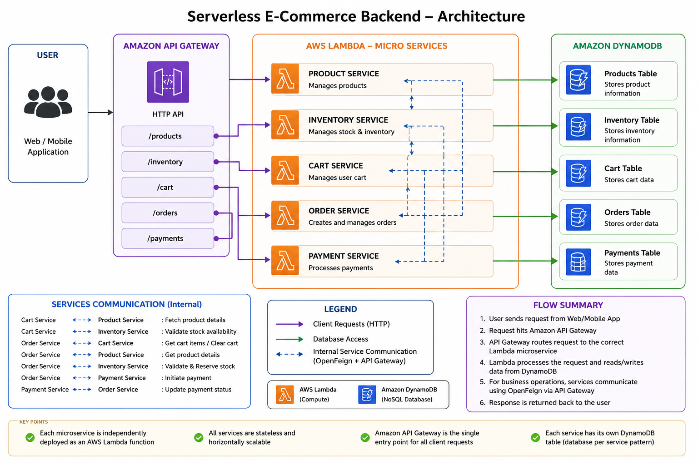

# 🛒 Serverless E-Commerce Microservices Backend

A cloud-native serverless e-commerce backend built using **Spring Boot 3**, **Java 21**, **AWS Lambda**, **Amazon API Gateway**, and **Amazon DynamoDB**.

The application consists of independent microservices deployed as AWS Lambda functions and exposed through a shared HTTP API Gateway, providing a scalable backend for an e-commerce platform.

---

## Architecture Diagram



# Tech Stack

### Backend

- Java 21
- Spring Boot 3
- Spring Data
- OpenFeign
- REST APIs
- Maven

### Cloud

- AWS Lambda
- Amazon API Gateway
- Amazon DynamoDB
- AWS IAM
- Amazon CloudWatch

---

# Microservices

| Service | Responsibility |
|----------|---------------|
| Product | Product Management |
| Inventory | Stock Management |
| Cart | Shopping Cart |
| Order | Order Processing |
| Payment | Payment Processing |

---

# Cloud Deployment

Each microservice is deployed independently as an AWS Lambda function.

| Lambda Function |
|----------------|
| product-service-lambda |
| inventory-service-lambda |
| cart-service-lambda |
| order-service-lambda |
| payment-service-lambda |

---

# API Gateway

A single Amazon HTTP API Gateway acts as the entry point.

```
Client
   │
   ▼
Amazon API Gateway
   │
   ├── /products
   ├── /inventory
   ├── /cart
   ├── /orders
   └── /payments
```

---

# DynamoDB Tables

- Products
- Inventory
- Cart
- Orders
- Payments

---

# Service Communication

The services communicate internally using OpenFeign through the shared API Gateway.

```
Cart
 ├──► Product
 └──► Inventory

Order
 ├──► Cart
 ├──► Product
 ├──► Inventory
 └──► Payment

Payment
 └──► Order
```

---

# Features

- Serverless Architecture
- RESTful APIs
- Independent Microservices
- Amazon DynamoDB Integration
- API Gateway Routing
- Lambda-based Deployment
- CloudWatch Logging
- IAM-based Permissions

---

# Project Structure

```
product-service/
inventory-service/
cart-service/
order-service/
payment-service/
```

Each service contains:

- Controllers
- Services
- Repositories
- DTOs
- Entities
- Lambda Handler
- DynamoDB Configuration

---

# Deployment Flow

```
Spring Boot Project
        │
        ▼
Build JAR
        │
        ▼
AWS Lambda
        │
        ▼
Amazon API Gateway
        │
        ▼
Client
```

---

# Testing

The APIs were tested using:

- AWS Lambda Test Events
- Postman

---

# Future Enhancements

- Spring Security + JWT Authentication
- Event-Driven Architecture using Amazon SNS & Amazon SQS
- Frontend Deployment using Amazon S3 & CloudFront
- CI/CD with GitHub Actions

---

# Author

**Deva**

Final Year B.Tech Artificial Intelligence & Data Science

Java Backend Developer | Spring Boot | AWS Serverless
